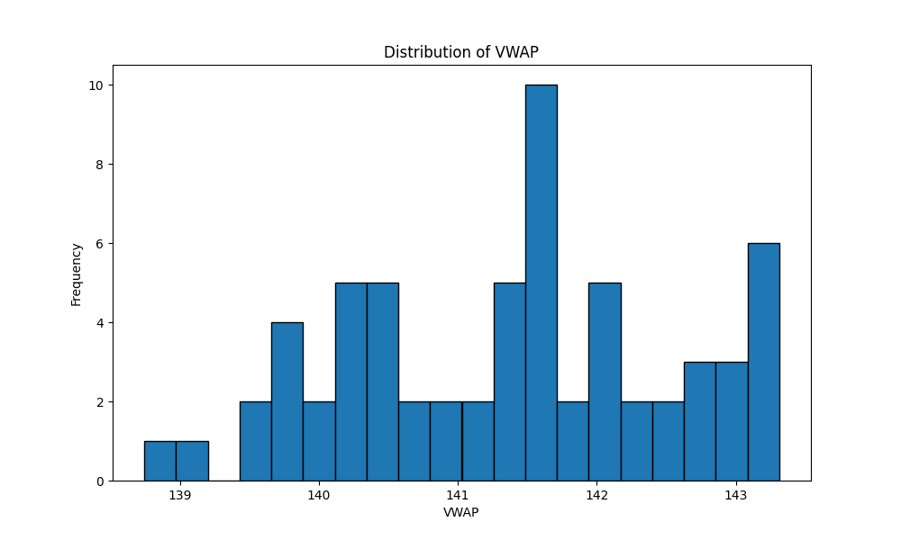

# Bund Futures Data Analysis

## Description
This project analyzes tick-level time-and-sales data for the December 2012 contract of the 10-year Bund Futures traded on EUREX. It processes data from a SQLite database and generates a CSV file with specific daily statistics.

### VWAP vs First Price Scatter

Each dot is a day where VWAP and first price had a little rendezvous. The closer to that diagonal line, the more they agreed with each other.

### VWAP vs First Price Over Time

### VWAP Distribution

### Flagged Days

 This is our "fashionably late" counter. Blue shows how many days played by the rules, while orange is for the rebels who started after 17:15:00.

## Features
- Reads tick data from a SQLite database
- Calculates daily statistics including:
  - First price of the day
  - Volume-weighted average price between 17:14:00 and 17:15:00
  - Flag for first price traded after 17:15:00
  - Time of first trade after 17:15:00 (if applicable)
- Outputs results to a CSV file

## Requirements
`pip install -r requirements.txt`
